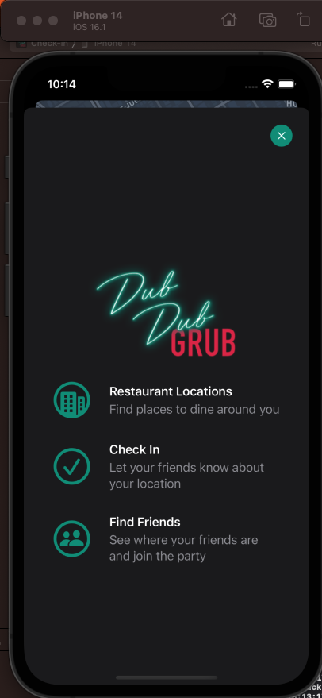
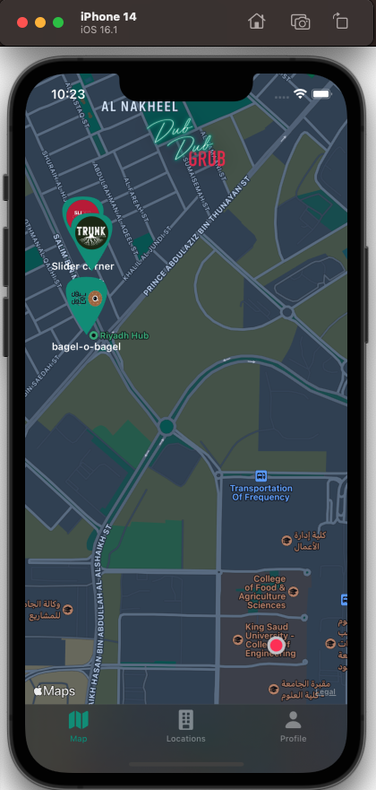
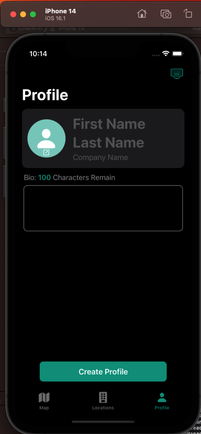
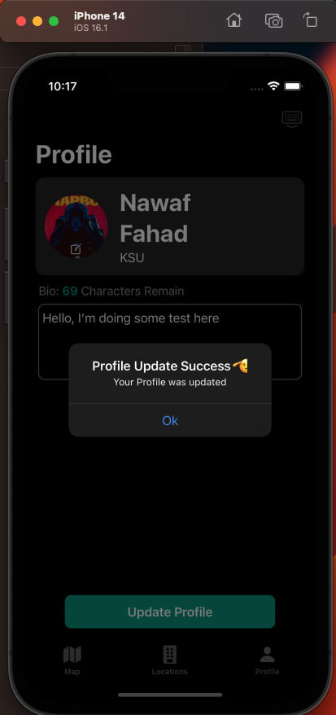
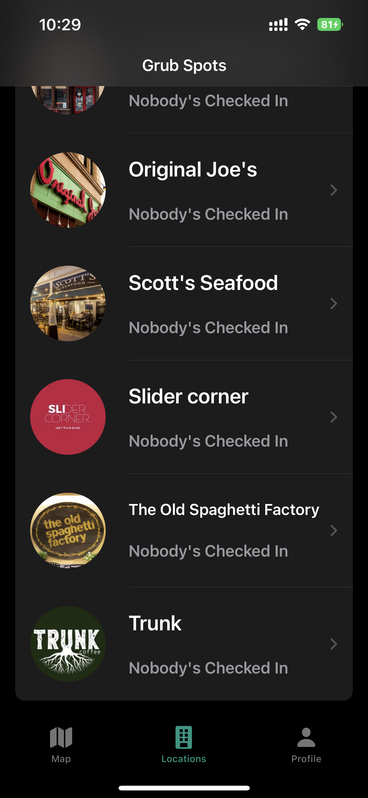
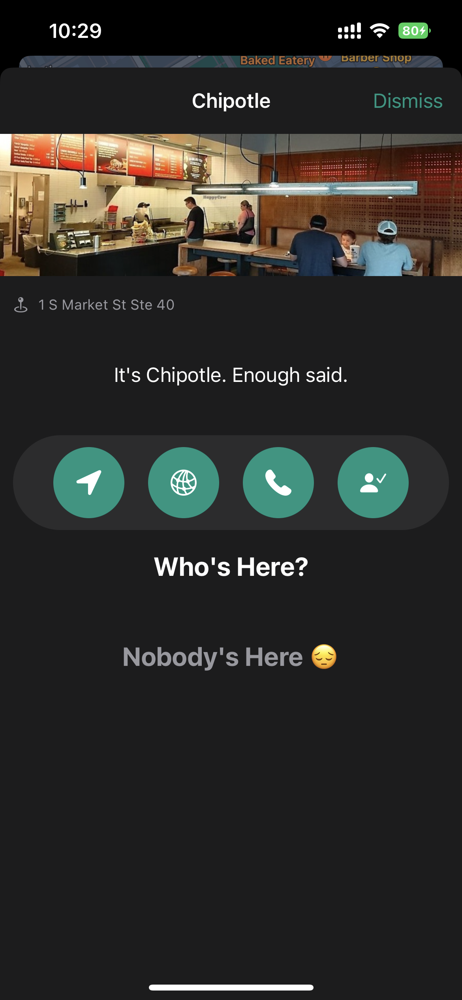
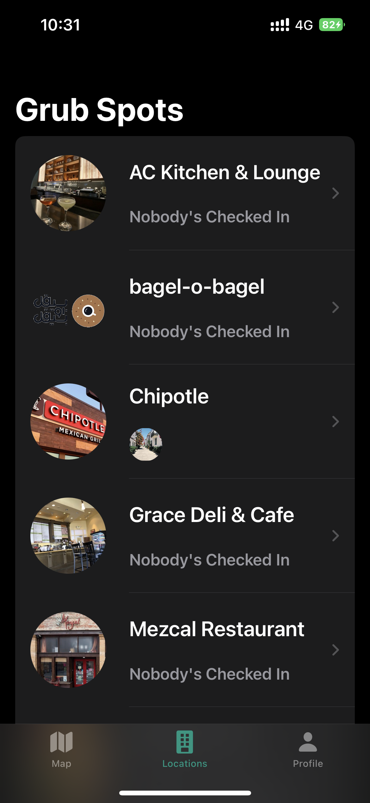
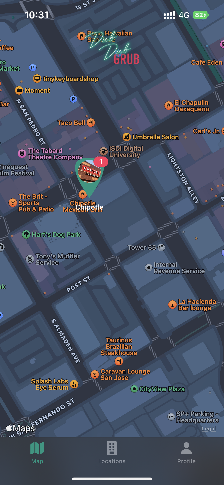

# Check-in

The project aims to find nearby restaurants and see how many people are there(people they already checked in)
It helps people to discover more places and see which areas are a trend now

it is build with MVVM ARCH

ScreenShot below 

## OnBoard Screen 

## First Screen
red dot represent user location 

## In this program i already use CloudKit , so user need to log in to thier Icloud account to use app

user need to fill (ALL) this fileds 

## Next Screen 

### user can update his/her profile 

### 

### Resturent List 

user can access Resturent from Map (OR) List

### Resturent Page 

### from here user can use Map to navigte or access Resturent WebSite or call Resturent or use check in button to reveal his location to freinds

#### after click (check-in) button user information will apper in who's there section and

